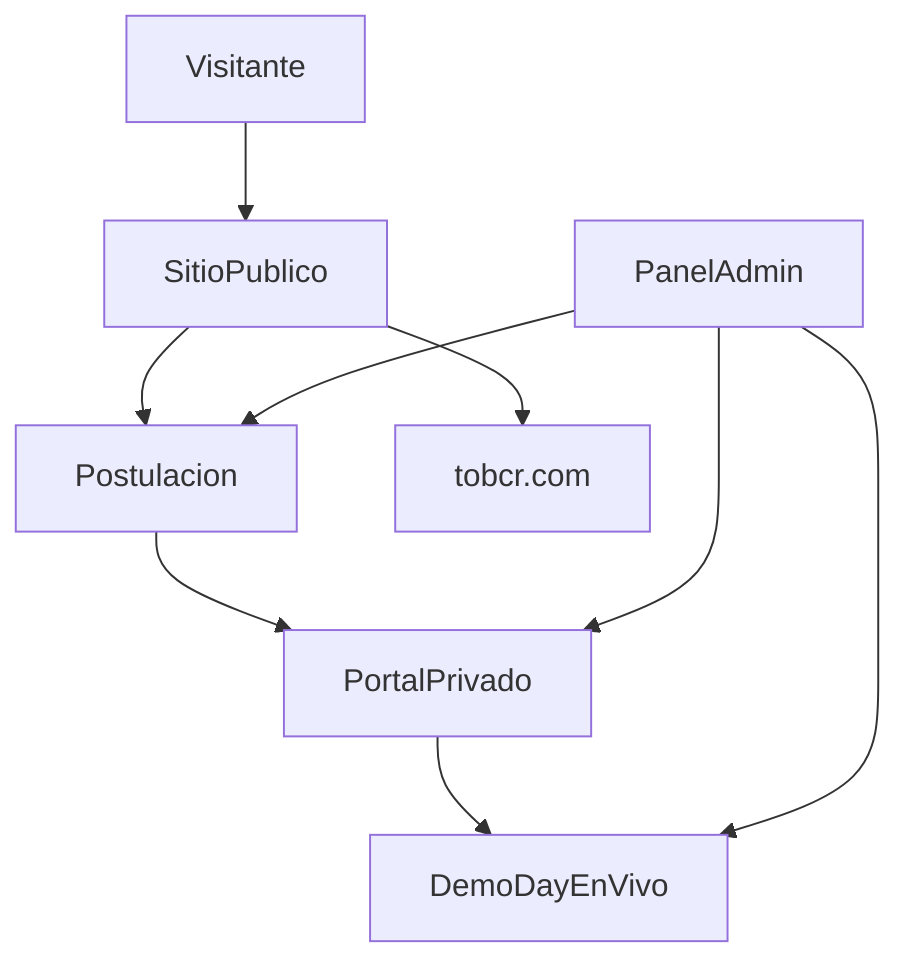

# HACKATOB 2026 — LANDING MASTER BRIEF

**Documento maestro de contexto, contenido y diseño visual**  
Technology on Business · Tecnológico de Costa Rica · Cartago

| Campo | Valor |
|---|---|
| Versión | 1.0 |
| Fecha | Julio 2026 |
| Estado | Fuente de verdad para implementación |
| Track de salud (congelado) | **HealthTrack** |
| Dominio objetivo | `hackatob.cr` |
| Alias | `hackatob.tobcr.com` → redirect 301 |

### Fuentes oficiales

1. Especificación Maestra Website HackaToB 2026 (Cursor) — v1.0, julio 2026  
2. Plan Maestro Operativo HackaToB 2026 — v1.0, emitido 22 julio 2026  
3. Assets de marca: logo HackaToB + mascota Spark  

### Uso de este documento

Este archivo es la **única fuente de verdad** para construir el landing y el sistema digital de HackaToB. No se publican datos, premios, logos ni correos sin confirmar. Cualquier divergencia con documentos anteriores (60 cupos, 3 tracks, 2 modalidades, MediTrack) queda **anulada**.

---

## 1. Idea rectora

> Cada persona es un nodo.  
> Cada equipo es una conexión.  
> Cada reto activa una posibilidad.  
> Cada solución amplía la red de innovación de Technology on Business.

El website no es una landing genérica. Es la **plataforma digital** de una competencia de innovación: institucional, creativa, tecnológica y claramente vinculada a ToB.

**Tono:** tecnológico, institucional, juvenil sin ser infantil, creativo, profesional, ambicioso, claro.

---

## 2. Datos innegociables

| Campo | Valor oficial |
|---|---|
| Evento | HackaToB 2026 |
| Organiza | Technology on Business (ToB), iniciativa estudiantil de la carrera ATI del Tecnológico de Costa Rica |
| Sede | TEC Campus Central, Cartago |
| Demo Day | Centro de las Artes |
| Fechas | Lunes 17 – jueves 20 de agosto de 2026 |
| Horario presencial | 9:00 a. m. – 6:00 p. m. |
| Capacidad | Hasta **80** participantes |
| Equipos | **15–20** equipos · máximo **4** personas |
| Tracks | **HealthTrack · GreenTrack · FinTrack · The Next Big Thing** |
| Modalidades | **Ideación · Prototipado · MVP funcional** |
| Mentores | 16 |
| Workshops | 14 |
| Jueces | 5 (3 fijos + 2 rotativos) |
| Resultados meta | 6 finalistas · Top 3 global · 2+ con continuidad · ≥60 % entregas · ≥80 % satisfacción |

**Advertencia:** no utilizar en ninguna pantalla los datos antiguos de 60 cupos, 3 tracks o 2 modalidades.

### Agenda operativa (congelada)

| Día | Nombre | Foco |
|---|---|---|
| Lunes 17 | PreHackaToB | Bienvenida, formación, clínicas por track, aprobación de concepto |
| Martes 18 | Desarrollo I | Validación y prototipo alfa |
| Miércoles 19 | Desarrollo II | Cierre de producto, ensayo, entrega (plataforma cierra 11:59 p. m.) |
| Jueves 20 | Demo Day | Revisión, exposición en Centro de las Artes, premiación |

**Principio operativo:** ningún proyecto pasa del registro al jurado sin: elegibilidad → aprobación del problema → prototipo alfa → entrega final → revisión técnica → presentación.

---

## 3. Relación ToB + HackaToB

### Dos productos, un ecosistema

| | **ToB** | **HackaToB** |
|---|---|---|
| Dominio | `tobcr.com` | `hackatob.cr` |
| Dueño | Compañero / equipo ToB | Equipo HackaToB |
| Job | Congreso + patrocinio | Convertir builders + operar el hackathon |
| CTA principal | Sé aliado / Inscribirse | **POSTULARME** |
| Identidad | Hexágono ToB / Master the Chaos | Logo H + Spark / Núcleo ToB |

### Dominios

1. Primario: `hackatob.cr`  
2. Alias: `hackatob.tobcr.com` → 301 a `hackatob.cr`  
3. En ToB: CTA “HackaToB →” apunta a `hackatob.cr`  
4. En HackaToB: link “← ToB” apunta a `tobcr.com`

### Repos recomendados

```
github.com/[org]/tob-website
github.com/[org]/hackatob-website
```

Dos proyectos Vercel · Cloudflare DNS · SSL Full (strict) · branch protection en `main`.

---

## 4. Objetivo de conversión

### Ciclo del producto digital

1. **DESCUBRIR** — qué es, fechas, tracks, modalidades, valor  
2. **POSTULAR** — solicitud individual o por equipo  
3. **PREPARAR** — cupo, equipo, reto, recursos  
4. **CONSTRUIR** — workshops, mentorías, checkpoints, entregables  
5. **PRESENTAR** — Demo Day, evaluación, transmisión  
6. **CONTINUAR** — proyectos, resultados, certificados, oportunidades  

### Regla de los 20 segundos

En menos de 20 segundos el visitante debe entender:

- Qué es HackaToB  
- Cuándo ocurre  
- Dónde ocurre  
- Quién puede participar  
- Cuántos cupos existen  
- Cuál es el siguiente paso  

**Métrica principal:** tasa de visitantes elegibles que **inician y completan** una postulación de calidad.

---

## 5. Arquitectura del sistema

Cuatro capas conectadas:

```
A. SITIO PÚBLICO          → informa, inspira, convierte
B. SISTEMA DE POSTULACIÓN → registra, valida, envía solicitudes
C. PORTAL PRIVADO         → cupo, equipo, agenda, recursos, entregas
D. PANEL ADMINISTRATIVO   → selección, contenido, Demo Day, evaluación
```



**Stack técnico**

| Capa | Tecnología |
|---|---|
| Frontend | Next.js App Router + TypeScript |
| UI | Tailwind CSS + tokens de marca |
| Animación | Motion (ex Framer Motion) |
| Backend | Supabase (Postgres, Auth, Storage, RLS) |
| Forms | Zod + React Hook Form + Server Actions |
| Deploy | Vercel + Cloudflare |
| Captcha | Cloudflare Turnstile |
| Email | Resend (cuando aplique) |

---

## 6. Sitemap

### Navegación pública visible

```
INICIO · EL EVENTO · TRACKS · RETOS · PROGRAMA · PARTICIPAR
COMUNIDAD · ALIADOS · PROYECTOS · FAQ
[POSTULARME]
```

**CTA dinámico por fase del evento**

| Fase | CTA principal |
|---|---|
| Prelanzamiento | RECIBIR NOVEDADES |
| Postulaciones | POSTULARME |
| Selección | VER MI ESTADO |
| Evento activo | VER AGENDA |
| Demo Day | VER TRANSMISIÓN |
| Postevento | CONOCER GANADORES |

### Sitemap completo (producto)

```
/
├── evento/
│   ├── que-es · objetivos · como-funciona · quienes-pueden-participar
│   ├── modelo-de-competencia · evaluacion · premios · reglamento
├── tracks/
│   ├── healthtrack · greentrack · fintrack · the-next-big-thing
├── retos/
│   ├── [slug] · proponer-un-reto
├── modalidades/
│   ├── ideacion · prototipado · mvp-funcional
├── programa/
│   ├── agenda-general · lunes-17 · martes-18 · miercoles-19 · jueves-20
│   ├── workshops · demo-day
├── participar/
│   ├── requisitos · proceso-de-seleccion · estado-de-solicitud
│   ├── lista-de-espera · team-matching
├── comunidad/
│   ├── mentores · jueces · speakers · equipo-organizador · voluntariado
├── aliados/
│   ├── sponsors · ser-aliado · proponer-reto · ser-mentor · media-kit
├── proyectos/
│   ├── galeria · finalistas · ganadores · impacto · [slug]
├── en-vivo/ · votacion · resultados
├── faq · contacto · prensa
├── legal/ (términos, privacidad, PI, IA, imagen, conducta, datos, votación)
├── acceso/ (login, cuenta, verificar, recuperar)
├── postulacion/ (iniciar, individual, equipo, revisar, confirmacion)
├── portal/ (dashboard, perfil, solicitud, cupo, equipo, matching,
│            agenda, recursos, mentorias, checkpoints, entregables,
│            notificaciones, certificados, feedback)
├── evaluacion/ (proyectos, rubrica, conflicto, deliberacion, resultados)
└── admin/ (dashboard, usuarios, postulaciones, seleccion, equipos,
            retos, tracks, agenda, workshops, mentores, jueces, aliados,
            entregables, evaluaciones, demo-day, votacion, proyectos,
            certificados, comunicaciones, contenido, analitica, config)
```

### MVP Fase 1 (publicar primero)

```
/
├── evento/ (que-es, como-funciona, quienes-pueden)
├── tracks/ (4 páginas)
├── modalidades/ (3 páginas)
├── retos/ + retos/[slug]
├── programa/ (agenda + días)
├── participar/requisitos + proceso-de-seleccion
├── postulacion/
├── comunidad/mentores + jueces
├── aliados/ + ser-aliado + media-kit
├── faq · contacto
└── legal/ (mínimo: reglamento, privacidad, PI, IA, imagen, conducta)
```

### Navegación móvil (drawer)

Agrupar: El evento · Tracks · Retos · Programa · Participar · Comunidad · Más (Aliados, Proyectos, FAQ, Contacto, Legal).  
**CTA fijo inferior:** POSTULARME.

---

## 7. Contenido de las 30 secciones (slides 07–36)

Los slides 01–06 y 37 son documentación interna del deck. **El website publica las secciones 07–36.**

Cada sección incluye: ruta · rol · copy · composición · movimiento · CTA · tracción · aceptación.

---

### SLIDE 07 — Barra de anuncio y header

| | |
|---|---|
| **Ruta** | Global |
| **Rol** | Orientación permanente |

**Estados de barra:** postulaciones abiertas · selección en proceso · evento en curso · Demo Day en vivo · resultados publicados.

**Header:** logo HackaToB / respaldo ToB · navegación · POSTULARME · Iniciar sesión · menú móvil.

**Composición:** transparente sobre el hero; azul oscuro + blur 16–20 px al scroll.

**Movimiento:** transición de fondo 240 ms · flecha animada en CTA.

**CTA:** POSTULARME (persistente).

**Tracción:** `announcement_view`, `header_cta_click` → KPI: CTA visible en 100 % del scroll; CTR header ≥ 4 %.

**Aceptación:** el visitante ubica el estado de convocatoria y accede a postulación desde cualquier punto.

---

### SLIDE 08 — Hero principal

| | |
|---|---|
| **Ruta** | `/` |
| **Rol** | Conversión primaria |

**Eyebrow:** TECHNOLOGY ON BUSINESS PRESENTA  

**Título:**  
CUATRO DÍAS.  
CUATRO ÁREAS.  
UNA OPORTUNIDAD PARA CONSTRUIR.

**Texto:**  
HackaToB reúne hasta 80 participantes en equipos interdisciplinarios para transformar retos reales de Costa Rica en ideas, prototipos y productos mínimos viables.

**Indicadores:** 17–20 AGO 2026 · 80 participantes · 15–20 equipos · 4 tracks · Top 3 global.

**Composición:** texto a la izquierda; Núcleo ToB + cuatro órbitas + red de nodos a la derecha (Spark puede acompañar).

**Movimiento:** título por líneas · órbitas secuenciales · paralaje máx. 8 px · contadores una sola vez.

**CTA:** POSTULARME · EXPLORAR RETOS.

**Tracción:** `hero_view`, `primary_cta_click`, `secondary_cta_click` → KPI: CTR hero ≥ 12 %; comprensión &lt; 20 s.

**Aceptación:** se entiende qué, cuándo, dónde, cupos y siguiente paso.

---

### SLIDE 09 — Respaldo de ToB

| | |
|---|---|
| **Ruta** | `/#respaldo` |
| **Rol** | Confianza institucional |

**Título:** 15 AÑOS CONECTANDO TALENTO. AHORA, CUATRO DÍAS PARA CONSTRUIR.

**Texto:** HackaToB nace dentro del ecosistema de Technology on Business, iniciativa estudiantil de la carrera de Administración de Tecnología de Información del Tecnológico de Costa Rica. Durante quince años, ToB ha articulado estudiantes, profesionales, academia e industria. HackaToB amplía ese legado hacia la creación de soluciones.

**Composición:** geometría ToB · línea ToB → talento → industria → soluciones · solo aliados confirmados.

**Movimiento:** logos blanco → color al hover · línea dibujada con scroll.

**CTA:** Conocer a los aliados.

**Tracción:** `institutional_view`, `sponsor_click` → KPI: ≥ 60 % de sesiones alcanzan esta sección.

**Aceptación:** se distingue organizador, respaldo académico y aliados.

---

### SLIDE 10 — Qué es HackaToB

| | |
|---|---|
| **Ruta** | `/#que-es` → `/evento/que-es` |
| **Rol** | Claridad de producto |

**Título:** UNA PLATAFORMA PARA LA INNOVACIÓN

**Texto:** HackaToB es una experiencia de innovación organizada por Technology on Business. Durante cuatro días, equipos interdisciplinarios investigan un problema, estructuran una solución, desarrollan una entrega y presentan resultados ante mentores, jueces, aliados y comunidad.

**Proceso:** Aprender · Definir · Construir · Validar · Presentar · Conectar.

**Composición:** red hexagonal · nodos conectados.

**Movimiento:** cada nodo activa el siguiente; al completar se forma geometría ToB. Sin loop.

**CTA:** Conocer cómo funciona.

**Tracción:** `process_step_view` → KPI: ≥ 50 % completa la animación explicativa.

**Aceptación:** se comprende selección, mentoría, entrega y continuidad.

---

### SLIDE 11 — Objetivos

| | |
|---|---|
| **Ruta** | `/evento/objetivos` |
| **Rol** | Propósito institucional |

**Título:** INNOVACIÓN JOVEN CON IMPACTO REAL

**Objetivos:**  
1. Conectar talento joven con retos reales.  
2. Brindar formación antes y durante el evento.  
3. Construir comunidad de innovación.  
4. Ampliar acceso a oportunidades.  
5. Despertar espíritu emprendedor.

**Composición:** ondas desde núcleo central.

**Movimiento:** ondas secuenciales (impacto, formación, comunidad, acceso, emprendimiento).

**CTA:** Ver modelo de competencia.

**Tracción:** `objectives_view`.

**Aceptación:** aliados identifican valor institucional.

---

### SLIDE 12 — Quiénes pueden participar

| | |
|---|---|
| **Ruta** | `/#audiencia` → `/evento/quienes-pueden-participar` |
| **Rol** | Identificación |

**Título:** NO NECESITAS LLEGAR CON TODO RESUELTO. NECESITAS ESTAR DISPUESTO A CONSTRUIR.

**Perfiles:** desarrollo, IA, datos, blockchain, ciberseguridad, UX/UI, producto, negocios, administración, finanzas, mercadeo, comunicación, salud, sostenibilidad, ingeniería, investigación, emprendimiento.

**Familias:** TECNOLOGÍA · PRODUCTO Y DISEÑO · NEGOCIO E IMPACTO.

**Mensajes:** postulación individual o por equipo · sin experiencia previa obligatoria · no todos deben programar.

**Composición:** mosaico de habilidades.

**Movimiento:** al seleccionar una habilidad se iluminan perfiles complementarios.

**CTA:** Revisar requisitos.

**Tracción:** `audience_skill_select` → KPI: ≥ 30 % interactúa.

**Aceptación:** perfiles no técnicos se reconocen elegibles.

---

### SLIDE 13 — Modelo de competencia

| | |
|---|---|
| **Ruta** | `/evento/modelo-de-competencia` |
| **Rol** | Reglas del juego |

**Título:** EQUIPOS INTERDISCIPLINARIOS. RETOS REALES. RESULTADOS VISIBLES.

**Datos:** 80 participantes · 15–20 equipos · máx. 4 · 4 tracks · 3 modalidades · 6 finalistas · Top 3 global.

**Roles sugeridos:** producto y problema · tecnología · diseño y experiencia · negocio, impacto y comunicación.

**Composición:** cuatro nodos independientes · área central vacía.

**Movimiento:** nodos se unen; si falta un perfil se muestra la habilidad recomendada.

**CTA:** Iniciar postulación.

**Tracción:** `competition_model_view`.

**Aceptación:** se entiende la necesidad de equipos interdisciplinarios.

---

### SLIDE 14 — Presentación de tracks

| | |
|---|---|
| **Ruta** | `/#tracks` → `/tracks` |
| **Rol** | Segmentación |

**Título:** CUATRO ÁREAS PARA TRANSFORMAR RETOS EN OPORTUNIDADES

**Tracks:** HealthTrack · GreenTrack · FinTrack · The Next Big Thing.

**Mensaje transversal:** todos los equipos compiten por el Top 3 global.

**Composición:** cuadrante de cuatro colores tenues · núcleo ToB.

**Movimiento:** track activo escala 1.03; otros bajan a 70 %; cambio ambiental suave.

**CTA:** Explorar track.

**Tracción:** `track_view`, `track_click` → KPI: ≥ 40 % visita al menos un track.

**Aceptación:** se distinguen las cuatro áreas y la clasificación general.

---

### SLIDE 15 — HealthTrack

| | |
|---|---|
| **Ruta** | `/tracks/healthtrack` |
| **Color** | `#19C9F2` |

**Título:** HEALTHTRACK — TECNOLOGÍA PARA VIVIR MEJOR

**Descripción:** soluciones en salud, bienestar, tecnología médica, prevención y calidad de vida.

**Líneas:** salud digital · prevención · nutrición · bienestar · tecnología médica · accesibilidad · experiencia del paciente · educación en salud · datos y seguimiento · atención comunitaria.

**Fondo / movimiento:** pulso celeste · nodos médicos · un pulso conecta personas, datos y servicios (solo al entrar o hover).

**CTA:** Ver retos HealthTrack · Postularme.

**Tracción:** `track_detail_view` (healthtrack).

**Aceptación:** identidad propia sin recursos visuales genéricos.

---

### SLIDE 16 — GreenTrack

| | |
|---|---|
| **Ruta** | `/tracks/greentrack` |
| **Color** | `#64D64E` |

**Título:** GREENTRACK — INNOVACIÓN PARA UN FUTURO SOSTENIBLE

**Descripción:** soluciones ambientales: sostenibilidad, agricultura, residuos, comunidades y recursos naturales.

**Líneas:** biodiversidad · agricultura · residuos · agua · energía · turismo sostenible · comunidades · recursos naturales · economía circular · resiliencia climática.

**Fondo / movimiento:** red orgánica verde sobre azul; se transforma en estructura tecnológica. Sin hojas flotando.

**CTA:** Ver retos GreenTrack · Postularme.

**Tracción:** `track_detail_view` (greentrack).

---

### SLIDE 17 — FinTrack

| | |
|---|---|
| **Ruta** | `/tracks/fintrack` |
| **Color** | `#7E4CF4` |

**Título:** FINTRACK — SOLUCIONES PARA UNA ECONOMÍA MÁS ACCESIBLE

**Descripción:** soluciones financieras, fintech, transparencia, educación e inclusión económica.

**Líneas:** inclusión financiera · educación financiera · pagos · ahorro · pymes · transparencia · fraude · ciberseguridad · acceso al crédito · finanzas digitales.

**Fondo / movimiento:** gráficas y nodos morados; la gráfica se construye. Evitar estética bancaria tradicional.

**CTA:** Ver retos FinTrack · Postularme.

**Tracción:** `track_detail_view` (fintrack).

---

### SLIDE 18 — The Next Big Thing

| | |
|---|---|
| **Ruta** | `/tracks/the-next-big-thing` |
| **Color** | `#FFD51F` |

**Título:** THE NEXT BIG THING — CONSTRUYE LO QUE TODAVÍA NO EXISTE

**Descripción:** soluciones abiertas con alto potencial de impacto, crecimiento o disrupción.

**Líneas:** IA · blockchain · automatización · nuevos modelos de negocio · tecnologías emergentes · experiencias digitales · educación · ciudades inteligentes · conectividad · soluciones de alto crecimiento.

**Fondo / movimiento:** cuadrícula vacía + amarillo controlado; se transforma en interfaz, red, dispositivo y solución.

**CTA:** Ver retos Next Big Thing · Postularme.

**Tracción:** `track_detail_view` (next-big-thing).

---

### SLIDE 19 — Tecnologías especiales

| | |
|---|---|
| **Ruta** | `/tracks#tecnologias` |
| **Rol** | Diferenciación técnica |

**Título:** TECNOLOGÍA COMO MEDIO PARA CREAR IMPACTO

**Áreas:** inteligencia artificial · blockchain · Think & Build Tech Ahead · herramienta recomendada.

**Mensaje:** la tecnología debe aportar valor real al problema y a la solución.

**Movimiento:** al seleccionar una tecnología aparecen ejemplos por track.

**CTA:** Ver retos por tecnología.

**Tracción:** `tech_select` → insumo para premios tecnológicos (60/40).

---

### SLIDE 20 — Catálogo de retos

| | |
|---|---|
| **Ruta** | `/retos` · `/retos/[slug]` |
| **Rol** | Motor de decisión |

**Título:** ELIGE UN PROBLEMA QUE VALGA LA PENA RESOLVER

**Datos de tarjeta:** nombre · código · track · organización · problema · beneficiarios · modalidad · dificultad · recursos · tecnología · especialista · estado.

**Filtros:** track · modalidad · dificultad · tecnología · organización · estado.

**Estados de reto:** borrador · en revisión · publicado · actualizado · cerrado · archivado.

**Regla:** no publicar retos incompletos ni sin responsable.

**Movimiento:** reordenamiento suave · borde según track · guardar reto con feedback inmediato.

**CTA:** Ver reto · Seleccionar reto · Proponer un reto.

**Tracción:** `challenge_view`, `challenge_filter`, `challenge_saved` → KPI: ≥ 35 % de postulantes abre o guarda un reto antes de postular.

---

### SLIDE 21 — Modalidades

| | |
|---|---|
| **Ruta** | `/modalidades` |
| **Rol** | Autoselección correcta |

**Título:** TRES FORMAS DE CONSTRUIR. UN MISMO ESTÁNDAR DE CALIDAD.

| Modalidad | Qué es |
|---|---|
| **Ideación** | Idea estructurada con problema, solución y valor |
| **Prototipado** | Representación visual o interactiva de la solución |
| **MVP funcional** | Primera versión operativa con funciones principales |

**Mensaje obligatorio:** la evaluación será proporcional a la modalidad. Más código no significa automáticamente una mejor solución.

**Composición:** capas idea → experiencia → producto. Pestañas en móvil.

**Movimiento:** cada nivel se construye sobre el anterior.

**CTA:** Ver guía de entrega.

**Tracción:** `modality_view`, `modality_select`.

---

### SLIDE 22 — Mentores

| | |
|---|---|
| **Ruta** | `/comunidad/mentores` |
| **Rol** | Prueba de acompañamiento |

**Título:** 16 MENTORES. UN SISTEMA COMPLETO DE ACOMPAÑAMIENTO.

**Distribución:** Generales 2 · Definir 5 · Construir 7 · Conectar 2.

**Áreas:** problema · solución · alcance · especialistas temáticos · producto · técnico · herramientas · especialistas tecnológicos · pitch · marketing y ventas.

**Datos públicos:** foto · nombre · cargo · organización · especialidad · bio breve · área · estado (confirmado / invitado).  
**Datos privados (portal):** disponibilidad · horarios · equipos · canal · notas.

**Movimiento:** filtrar por Definir / Construir / Conectar.

**CTA:** Postularme como mentor.

**Tracción:** `mentor_view`, `mentor_filter`.

---

### SLIDE 23 — Workshops

| | |
|---|---|
| **Ruta** | `/programa/workshops` |
| **Rol** | Valor formativo |

**Título:** 14 WORKSHOPS PARA PASAR DE LA IDEA A LA DEFENSA

**Generales:** propuesta de valor · UX/UI · propiedad intelectual · stack de herramientas · marketing y ventas · pitch y defensa.

**Por track:** sostenibilidad · innovación · finanzas · salud.

**Tecnología:** IA · blockchain · tecnologías generales · herramienta recomendada.

**Movimiento:** cada workshop ilumina una parte del recorrido del proyecto.

**CTA:** Ver agenda.

**Tracción:** `workshop_view`.

---

### SLIDE 24 — Jurado

| | |
|---|---|
| **Ruta** | `/comunidad/jueces` |
| **Rol** | Legitimidad |

**Título:** 5 JUECES. UNA EVALUACIÓN MULTIDISCIPLINARIA.

**Fijos:** negocio · factibilidad técnica · mercadeo y ventas.  
**Rotativos:** especialista temático · especialista tecnológico.

**Composición:** tres jueces centrales · dos órbitas laterales.

**Movimiento:** los rotativos cambian según track y tecnología del proyecto.

**CTA:** Ver rúbrica completa.

**Tracción:** `judge_view`.

**Aceptación:** el patrocinio nunca se confunde con influencia en resultados.

---

### SLIDE 25 — Evaluación

| | |
|---|---|
| **Ruta** | `/evento/evaluacion` |
| **Rol** | Transparencia |

**Título:** REGLAS CLARAS. RESULTADOS TRANSPARENTES.

Ver rúbrica oficial en la sección 11 de este documento.

**También:** conflicto de interés · desempate · deliberación documentada · especialistas no votantes cuando aplique.

**Composición:** fondo sobrio · líneas rectas · sin partículas intensas.

**Movimiento:** barras desde cero · tooltip · una sola ejecución.

**CTA:** Ver reglamento.

**Tracción:** `rubric_view`, `rubric_tooltip`.

---

### SLIDE 26 — Agenda general

| | |
|---|---|
| **Ruta** | `/#programa` → `/programa/agenda-general` |
| **Rol** | Compromiso de disponibilidad |

**Título:** APRENDER. CONSTRUIR. CONECTAR.

| Día | Nombre |
|---|---|
| Lunes 17 | PreHackaToB |
| Martes 18 | Desarrollo I |
| Miércoles 19 | Desarrollo II |
| Jueves 20 | Demo Day |

**Movimiento:** progreso 20 % → 55 % → 90 % → 100 %.

**CTA:** Ver agenda completa.

**Tracción:** `agenda_view`, `day_expand` → KPI: ≥ 45 % revisa agenda antes de postular.

---

### SLIDE 27 — Lunes 17

| | |
|---|---|
| **Ruta** | `/programa/lunes-17` |

**Título:** DÍA 1 — APRENDER, CONECTAR Y DEFINIR  
**Modalidad:** física y virtual.

**Actividades:** bienvenida · reglas · retos · workshops · interacción · team matching · problema y usuario · modalidad · roles · plan · checkpoint · mentor.

**Resultado:** equipo, track, reto, modalidad, problema, roles, plan y mentor.

**Fondo / movimiento:** azul eléctrico · nodos agrupándose · participantes separados forman equipos.

---

### SLIDE 28 — Martes 18

| | |
|---|---|
| **Ruta** | `/programa/martes-18` |

**Título:** DÍA 2 — DEFINIR Y CONSTRUIR

**Actividades:** trabajo en equipo · acompañamiento · validación · propuesta de valor · UX · arquitectura · herramientas · repositorio · primer prototipo · mentorías técnicas.

**Resultado:** problema validado, flujo, arquitectura, repositorio y prototipo.

**Fondo / movimiento:** morado · boceto → wireframe → interfaz.

---

### SLIDE 29 — Miércoles 19

| | |
|---|---|
| **Ruta** | `/programa/miercoles-19` |

**Título:** DÍA 3 — INTEGRAR, PROBAR Y PREPARAR

**Actividades:** integración · pruebas · correcciones · impacto · viabilidad · pitch · demo · mentorías finales · ensayo · entrega · documentación.

**Resultado:** entrega final, pitch, demo, repositorio o prototipo y continuidad.

**Nota operativa:** la plataforma de entrega cierra a las 11:59 p. m.

**Fondo / movimiento:** celeste · en construcción → en pruebas → listo → entregado.

---

### SLIDE 30 — Jueves 20

| | |
|---|---|
| **Ruta** | `/programa/jueves-20` |

**Título:** DÍA 4 — PRESENTAR, EVALUAR Y CONECTAR  
**Sede Demo Day:** Centro de las Artes.

**Actividades:** exposición · demo · preguntas · evaluación · deliberación · premiación · reconocimientos · continuidad · networking · resultados · cierre.

**Resultado:** 6 finalistas, Top 3 y oportunidades de continuidad.

**Fondo / movimiento:** escenario · luz amarilla · indicador EN VIVO · **sin partículas durante el pitch**.

---

### SLIDE 31 — Postulación

| | |
|---|---|
| **Ruta** | `/postulacion/*` |
| **Rol** | Conversión principal |

**Título:** POSTÚLATE INDIVIDUALMENTE O CON TU EQUIPO

**Pasos:** conocer → revisar → crear cuenta → completar → seleccionar intereses → enviar → evaluación → selección → confirmación → team matching → participación.

**Mensaje obligatorio:** Enviar una solicitud no garantiza cupo.

**Movimiento:** transición lateral · guardado automático · progreso visible · confirmación con Núcleo ToB / Spark.

**CTA:** Iniciar solicitud.

**Tracción:**  
`application_started` · `application_step_completed` · `application_abandoned` · `application_submitted`  

**KPI principal:** tasa de visitantes elegibles que inician y completan una postulación de calidad. Abandono por paso &lt; 15 %.

**Aceptación:** no se pierde información; se comunica cuándo habrá respuesta.

#### Campos mínimos del formulario (resumen)

1. Cuenta (correo, verificación, consentimiento)  
2. Información personal  
3. Perfil y habilidades  
4. Motivación  
5. Preferencias (track, modalidad, individual/equipo)  
6. Equipo (si aplica)  
7. Declaraciones (reglamento, conducta, privacidad, imagen, PI, IA)  
8. Revisión y envío  

---

### SLIDE 32 — Portal

| | |
|---|---|
| **Ruta** | `/portal` |
| **Rol** | Retención y operación |

**Título:** TODO TU HACKATOB EN UN SOLO LUGAR

**Módulos:** estado · cupo · perfil · equipo · track · reto · modalidad · agenda · mentorías · workshops · checkpoints · recursos · entregables · notificaciones · certificados.

**Composición:** centro de operaciones · mapa de progreso.

**Movimiento:** cada tarea completada ilumina un tramo del circuito del equipo.

**CTA:** Confirmar cupo · Completar equipo.

**Tracción:** `seat_confirmed`, `team_created`, `submission_started`, `submission_completed` → KPI: ≥ 60 % de equipos con entrega final.

---

### SLIDE 33 — Aliados

| | |
|---|---|
| **Ruta** | `/aliados` |
| **Rol** | Conversión B2B |

**Título:** ORGANIZACIONES QUE CONVIERTEN RETOS EN OPORTUNIDADES

**Aportes:** especialistas · mentores · jueces · herramientas · retos · premios · alimentación · producción · financiamiento · especie · continuidad.

**Clasificación:** Presenting Partner · Track Partner · Challenge Partner · Technology Partner · Food & Beverage · Media · Academic · Community · In-kind.

**Regla:** solo organizaciones formalmente confirmadas.

**Movimiento:** hover muestra aporte y función específica.

**CTA:** Patrocinar · Proponer un reto · Ser mentor · Descargar media kit.

**Tracción:** `sponsor_click`, `media_kit_download`, `partner_form_submitted`.

---

### SLIDE 34 — Demo Day en vivo

| | |
|---|---|
| **Ruta** | `/en-vivo` (+ `/votacion`, `/resultados`) |
| **Rol** | Audiencia y legitimidad |

**Antes:** cuenta regresiva · agenda · finalistas · jurado · cómo ver.  
**Durante:** video · EN VIVO · equipo actual · track · modalidad · cronómetro · siguiente · votación.  
**Después:** grabación · ganadores · galería · proyectos · resultados.

**Protecciones de votación:** auth o código · una votación por persona · rate limiting · cierre automático · auditoría · resultados oficiales separados del voto público.

**Composición:** escenario digital · reproductor dominante.

**Movimiento:** el estado de la página cambia por fase.

**CTA:** Ver transmisión · Votar.

**Tracción:** `demo_day_play`, `demo_day_watch_time`, `public_vote_submitted` → KPI: permanencia media ≥ 15 min.

---

### SLIDE 35 — Resultados y continuidad

| | |
|---|---|
| **Ruta** | `/proyectos` · `/proyectos/[slug]` |
| **Rol** | Memoria y activo permanente |

**Título:** LAS SOLUCIONES NO TERMINAN CON LA PREMIACIÓN

**Indicadores meta:** ≥60 % entregas · ≥80 % satisfacción · 6 finalistas · 3 ganadores · 2+ con continuidad.

**Ficha de proyecto:** nombre · equipo · track · modalidad · problema · solución · impacto · tecnología · demo · pitch · repositorio · reconocimiento · próximos pasos.

**Movimiento:** cada proyecto con continuidad extiende su línea fuera de HackaToB. Sin autoplay de video.

**CTA:** Explorar proyectos.

**Tracción:** `project_view`, `certificate_download`.

---

### SLIDE 36 — FAQ y cierre

| | |
|---|---|
| **Ruta** | `/faq` + `/#cierre` |
| **Rol** | Eliminar objeciones + última conversión |

**FAQ categorías:** postulación · selección · equipos · tracks · retos · modalidades · fechas · sede · alimentación · IA · blockchain · PI · evaluación · premios · certificados · contacto.

**CTA final:**  
COSTA RICA TIENE RETOS.  
LA PRÓXIMA SOLUCIÓN PUEDE EMPEZAR CONTIGO.

**Botones:** POSTULARME AHORA · EXPLORAR RETOS.

**Contacto (validar tipografía antes de publicar):**

- Technology on Business — `tob@itcr.ac.cr` · +506 7088 0176  
- Coordinación de Innovación — `derojas@estudiantec.cr` · +506 7006 9315  

**Movimiento:** nodos convergen hacia el CTA.

**Tracción:** `faq_search`, `faq_open`, `final_cta_click` → KPI: CTR CTA final ≥ 6 %.

---

## 8. Sistema visual

### Concepto

Innovación institucional con energía competitiva. Oscuro y tecnológico **sin saturar**. Cada pantalla: una idea dominante, contraste alto, espacio.

### Paleta base

| Token | Hex | Uso |
|---|---|---|
| Azul noche | `#061426` | Fondo principal |
| Azul profundo | `#081D3A` | Profundidad |
| Panel | `#0B2348` | Superficies / tarjetas |
| Azul eléctrico | `#2F6BFF` | Acentos institucionales |
| Celeste | `#11CFF3` | Líneas, hover, info |
| Morado | `#7A3FF2` | FinTrack / profundidad |
| Amarillo Spark | `#FFD51F` | CTA, Demo Day, Next Big Thing |
| Blanco | `#F7FAFF` | Texto primario |
| Texto secundario | `#B8C4D9` | Cuerpo auxiliar |
| Línea tenue | `rgba(124, 162, 214, 0.22)` | Bordes |

### Colores por track

| Track | Color |
|---|---|
| HealthTrack | `#19C9F2` |
| GreenTrack | `#64D64E` |
| FinTrack | `#7E4CF4` |
| The Next Big Thing | `#FFD51F` |

### Tipografía

- Títulos: sans geométrica, bold / extrabold.  
- Cuerpo: sans altamente legible.  
- Máximo 2 familias.  
- Máximo ~75 caracteres por línea de texto largo.

| Nivel | Desktop | Móvil |
|---|---|---|
| H1 | 56–88 px | 38–52 px |
| H2 | 40–60 px | 30–40 px |
| H3 | 24–34 px | — |
| Cuerpo destacado | 18–22 px | — |
| Cuerpo | 16–18 px | — |
| Etiquetas | 12–14 px · mayúsculas · tracking moderado | — |

### Tarjetas

- Fondo oscuro semitransparente  
- Borde 1 px  
- Radio 18–28 px  
- Sombra baja · glow contenido  
- Hover: scale máximo **1.03** · elevación 4–8 px  

### Logo y Spark

| Elemento | Uso |
|---|---|
| **Logo HackaToB** | Nav, footer, Open Graph. Ideal SVG: barras → anillo dibujado → estrella. Idle: anillo ~22 s. |
| **Núcleo ToB** | Hero y confirmaciones institucionales. |
| **Spark** | Solo en 4 momentos: hero (idle), confirmación postulación (celebrate), CTA final (point), Demo Day espera (waiting). Prohibido en jurado, rechazos o durante pitch. |

### Motor de fondos (7 capas)

1. Base — gradiente azul noche vertical  
2. Profundidad — manchas radiales (opacidad máx. 0.12)  
3. Grid — 56–80 px, opacidad 0.03–0.08  
4. Ruido — 0.02–0.04  
5. Nodos — 20–30 desktop / 8–12 móvil  
6. Órbitas — rotación 18–40 s  
7. Contexto por sección (pulso Health, red Green, gráficas Fin, formas Next)

**Transición entre secciones:** 700–1200 ms; sin cortes duros de color.

### Fondos por bloque

| Bloque | Tratamiento |
|---|---|
| Institucional | Azul oscuro, geometría ToB, movimiento mínimo |
| Tracks | Cuatro zonas tenues; zona activa al hover/scroll |
| Modalidades | Capas idea → experiencia → producto |
| Mentores / workshops | Red de conocimiento |
| Evaluación | Sobrio, líneas rectas, sin glow intenso |
| Agenda | Color por día (eléctrico / morado / celeste / amarillo+azul) |
| Demo Day | Escenario digital, luz amarilla, EN VIVO |
| Resultados | Líneas ascendentes |
| Cierre | Convergencia de nodos al CTA |

### Responsive de fondos

- **Desktop:** todas las capas; paralaje suave; máx. 30 nodos.  
- **Tablet:** −35 % partículas.  
- **Móvil:** sin paralaje de cursor; 8–12 nodos; sin video de fondo; priorizar contraste.

---

## 9. Sistema de movimiento

### Tres capas

1. **Ambiental** (8–40 s) — órbitas, glows, Spark float, nodos.  
2. **Explicativo** (una vez) — timelines, barras, pasos, rúbrica.  
3. **Interactivo** — hover, tabs, filtros, formulario.

### Tokens

| Token | Valor |
|---|---|
| Microinteracción | 140–220 ms |
| Entrada de componente | 450–650 ms |
| Cambio de sección | 700–1200 ms |
| Ambiente | 8–40 s |
| Confirmación | máx. 900 ms |
| Entrada estándar | opacity 0→1 · translateY 18–24 px → 0 |
| Stagger tarjetas | 80–120 ms |
| Hover scale | ≤ 1.03 |
| Elevación hover | 4–8 px |
| Ease entrada | `cubic-bezier(0.22, 1, 0.36, 1)` |

**Regla:** tween para scroll/carga; spring para gestos del usuario.  
**Animar solo:** `transform` y `opacity`.  
**Scroll:** `viewport once: true`.

### Accesibilidad de motion

Si `prefers-reduced-motion`:

- Eliminar órbitas, paralaje y líneas progresivas.  
- Mantener solo fade corto.  
- No ocultar información detrás de animaciones.

### Librería

`motion` (Motion / Framer Motion). Componentes base: `Reveal`, `Stagger`, `Spark`, `LogoAnimated`, `DrawLine`, `CountUp`.

---

## 10. Rúbrica oficial

| Criterio | % |
|---|---|
| Propuesta de valor y negocio | 20 |
| Innovación y tecnología | 20 |
| Factibilidad | 15 |
| Necesidad y contexto | 15 |
| Usuarios y experiencia | 10 |
| Pitch | 10 |
| Desarrollo o avance | 5 |
| Marketing y comunicación digital | 5 |
| **Total** | **100** |

**Premios tecnológicos:** evaluación general **60 %** + especialista tecnológico **40 %**.

**Premios (mostrar montos solo si el financiamiento está confirmado):** Top 3 global + reconocimiento al primer lugar de cada track + reconocimientos adicionales (impacto, diseño, tecnología, pitch, público).

---

## 11. Embudo y analítica

### Embudo

```
Visitante
→ Visitante elegible
→ Inicia postulación
→ Completa postulación          ← MÉTRICA PRINCIPAL
→ Es seleccionado
→ Confirma cupo
→ Participa
→ Entrega proyecto              ← meta ≥60 %
→ Presenta
→ Continúa
```

### Eventos mínimos

`hero_view` · `primary_cta_click` · `secondary_cta_click` · `track_view` · `challenge_view` · `challenge_filter` · `application_started` · `application_step_completed` · `application_abandoned` · `application_submitted` · `login_completed` · `seat_confirmed` · `team_created` · `mentor_view` · `sponsor_click` · `resource_download` · `submission_started` · `submission_completed` · `demo_day_play` · `demo_day_watch_time` · `public_vote_submitted` · `project_view` · `certificate_download`

---

## 12. Calidad: accesibilidad, rendimiento, seguridad

### Accesibilidad

- Contraste AA · navegación por teclado · foco visible  
- Alt text · labels · no depender solo del color  
- `prefers-reduced-motion` · sin flashes rápidos · lectores de pantalla  

### Rendimiento

- Hero &lt; 1.5 MB · WebP/AVIF · lazy loading  
- Animar transform/opacity · reducir partículas en móvil  
- Sin video automático de fondo  
- **Lighthouse ≥ 90** (rendimiento, accesibilidad, SEO)  

### Seguridad

- HTTPS · validación de formularios · rate limiting  
- Auth segura · control por roles (RLS) · consentimiento explícito  
- Protección de datos y de votación · auditoría de resultados  
- No exponer información privada de participantes  

### SEO por página

Título único · descripción · URL canónica · Open Graph · imagen social · datos estructurados (`Event`, `Organization`, `Person`, `FAQPage`, `BreadcrumbList`) · H1 · contenido indexable sin JS obligatorio.

**Ejemplo title:** `HackaToB 2026 | Innovación, tecnología e impacto en Costa Rica`  
**Ejemplo description:** Participa en HackaToB 2026, una experiencia de innovación de cuatro días organizada por Technology on Business en el TEC, Cartago.

---

## 13. Fases de construcción

| Fase | Entrega | Slides / foco | Alineación operativa |
|---|---|---|---|
| **1 · Lanzamiento** | Público MVP + postulación + FAQ + legal | 07–14, 20–21, 26, 31, 33, 36 | Cerrar reglamento y estructura (~24 jul) |
| **2 · Selección** | Login, estado, cupo, perfil, equipo, matching, admin selección | 32 (parcial) | Captar y confirmar (~31 jul–5 ago) |
| **3 · Operación** | Agenda, mentorías, checkpoints, recursos, entregables | 22–23, 27–29, 32 | Pruebas 5–12 ago |
| **4 · Demo Day** | `/en-vivo`, votación, evaluación, resultados | 24–25, 30, 34 | 20 ago |
| **5 · Continuidad** | Galería, certificados, impacto, alumni | 35 | Postevento |

**Congelamiento:** desde el 13 de agosto solo cambios por seguridad, sede crítica, fuerza mayor o decisión formal.

---

## 14. Cómo empiezo

### 14.1 Stack mínimo del Día 1

```bash
npx create-next-app@latest hackatob-website --typescript --tailwind --eslint --app
cd hackatob-website
npm install motion
# Luego: GitHub → Vercel → Cloudflare DNS
```

### 14.2 Estructura de carpetas recomendada

```
src/ o raíz/
├── app/
│   ├── (public)/          # marketing
│   ├── (auth)/            # acceso + postulacion
│   ├── (portal)/          # portal privado
│   ├── (admin)/           # admin
│   ├── layout.tsx
│   └── globals.css        # tokens CSS
├── components/
│   ├── layout/            # Header, Footer, AnnouncementBar
│   ├── marketing/         # Hero, Tracks, Timeline…
│   ├── motion/            # Reveal, Stagger
│   ├── spark/             # Spark
│   └── ui/                # Button, Accordion…
├── lib/
│   ├── content/           # copy tipado (fuente de verdad en código)
│   ├── motion.ts          # tokens de animación
│   └── supabase/          # client / server / middleware
├── public/
│   ├── logo-hackatob.svg|png
│   └── spark.png
└── docs/
    └── HackaToB_Landing_Master_Brief.md  ← este archivo
```

### 14.3 Día 1 — 4 horas (arranque)

| Bloque | Tiempo | Entrega |
|---|---|---|
| 1 · Cimientos | 50 min | Next + GitHub + Vercel preview |
| 2 · Marca | 60 min | Tokens CSS + Header + Footer + assets en `/public` |
| 3 · Hero | 75 min | Copy oficial + métricas + Spark float + CTAs + mobile 390 px |
| 4 · Cierre | 40 min | README + mensaje al compañero ToB + retro |

**Done Día 1:** localhost muestra hero · preview Vercel · nav con link a ToB · commits claros.

### 14.4 Primeros componentes a crear

1. `globals.css` — variables de paleta  
2. `AnnouncementBar`  
3. `PublicHeader` / `Footer`  
4. `PrimaryCTA` / `SecondaryCTA`  
5. `Hero` + `Countdown`  
6. `Reveal` / `Stagger` (Motion)  
7. `Spark` (estado idle)  
8. `lib/content/home.ts` — copy tipado del hero y métricas  

### 14.5 Orden de secciones en `page.tsx` (Fase 1)

1. AnnouncementBar  
2. Header  
3. Hero (08)  
4. Respaldo ToB (09)  
5. Qué es (10)  
6. Audiencia (12)  
7. Tracks overview (14)  
8. Retos destacados (20)  
9. Modalidades (21)  
10. Agenda (26)  
11. Postulación teaser (31)  
12. Aliados (33)  
13. FAQ + CTA final (36)  
14. Footer  

### 14.6 Checklist de lanzamiento Fase 1

- [ ] Datos oficiales 80 / 4 tracks / 3 modalidades en todo el sitio  
- [ ] HealthTrack como único nombre del track de salud  
- [ ] Hero &lt; 20 s de comprensión  
- [ ] CTA Postularme en nav + hero + final  
- [ ] Formulario recibe solicitudes  
- [ ] Mensaje “no garantiza cupo” visible  
- [ ] Solo logos/aliados/premios confirmados  
- [ ] Legal mínimo enlazado en footer  
- [ ] Mobile 390 px usable  
- [ ] `prefers-reduced-motion` respetado  
- [ ] Open Graph + title  
- [ ] Link cruzado ToB ↔ HackaToB  
- [ ] Preview Vercel + dominio (o plan DNS documentado)  

### 14.7 Mensaje tipo al compañero ToB

```
HackaToB Día 1:
- Repo: [link]
- Preview: [link Vercel]
- Hero + nav con link a tobcr.com

Cuando ToB tenga preview, poner en nav:
HackaToB → https://hackatob.cr (o preview temporal)

Datos congelados: 80 cupos · 4 tracks (Health/Green/Fin/Next) · 3 modalidades.
```

---

## 15. Footer (estructura)

**Columnas:**

1. **HACKATOB** — Inicio · Qué es · Tracks · Retos · Programa · FAQ  
2. **PARTICIPAR** — Requisitos · Postularme · Estado · Team Matching · Reglamento  
3. **COMUNIDAD** — Mentores · Jueces · Speakers · Voluntariado · Proyectos  
4. **ORGANIZACIÓN** — Technology on Business · Aliados · Media kit · Contacto · Privacidad · PI  

**Inferior:** ToB · TEC · Cartago · redes · correo · © 2026 · versión del sitio.

**Links legales permanentes:** reglamento · privacidad · PI · uso de IA · uso de imagen · código de conducta · contacto.

---

## 16. Pendientes por confirmar

Antes de publicar, validar:

- [ ] Nombre comercial definitivo si Marketing exige alias “MediTrack” (hoy congelado: **HealthTrack**)  
- [ ] Correos y teléfonos (evitar tipografías erróneas en docs de origen)  
- [ ] Hora exacta de inicio / countdown  
- [ ] Cierre de postulaciones  
- [ ] Montos de premios (solo si hay financiamiento confirmado)  
- [ ] Lista de mentores, jueces y aliados con permiso de nombre/foto  
- [ ] Retos con organización responsable y ficha completa  
- [ ] Stack / herramienta recomendada oficial  
- [ ] Dominio `hackatob.cr` adquirido y DNS en Cloudflare  
- [ ] Textos legales en PDF o páginas `/legal/*`  

---

## 17. Frase para recordar

> Landing corta que convierte + sitemap profundo después.  
> Motion explica, no decora. Spark guía, no satura.  
> Dos repos, un dominio padre, un objetivo: postulaciones de calidad.  
> Datos oficiales: **80 · 4 tracks · 3 modalidades · HealthTrack**.

---

**Fin del documento**  
HackaToB 2026 · Landing Master Brief v1.0  
Technology on Business · Tecnológico de Costa Rica · Cartago  
Implementación: Cursor · Next.js · Tailwind · Motion · Supabase · Vercel · Cloudflare
